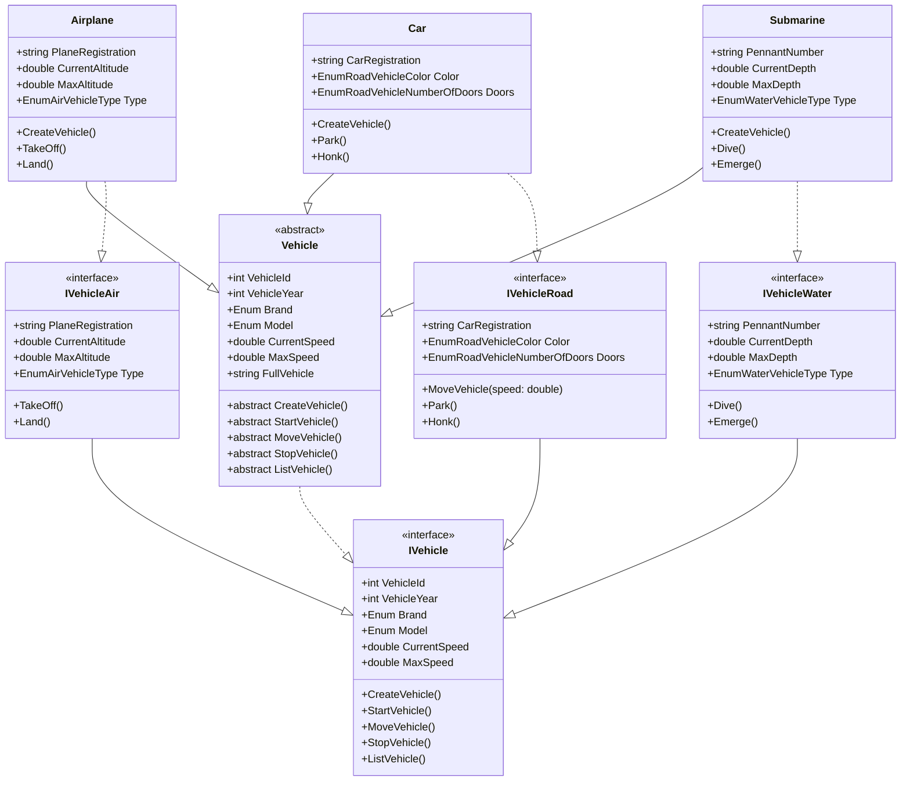

# Vehicle Management System

An object-oriented C# application implementing a comprehensive vehicle management system with support for different vehicle types (Air, Road, Water) using advanced OOP concepts.

## Project Overview

This project demonstrates the implementation of a flexible and extensible vehicle management system using C# and object-oriented programming principles. The system handles various types of vehicles (Air, Road, and Water) with specific behaviors and characteristics for each type.

## Features

### Core Functionality
- Vehicle creation and management
- Type-specific vehicle operations
- Real-time vehicle status tracking
- Vehicle information display
- Input validation and error handling

### Technical Implementation

#### Object-Oriented Programming (OOP)
- Inheritance hierarchy with abstract base class
- Interface segregation (IVehicle, IVehicleAir, IVehicleRoad, IVehicleWater)
- Polymorphism (method overriding and overloading)
- Encapsulation with properties and access modifiers
- Abstract methods and classes

#### Design Patterns & Principles
- Interface Segregation Principle (ISP)
- Single Responsibility Principle (SRP)
- Open/Closed Principle (OCP)
- Strategy Pattern implementation
- Factory Method Pattern elements

#### C# Advanced Features
- Enums for type safety
- Properties with auto-implementation
- Virtual and override methods
- Generic collections
- Extension methods
- String interpolation
- Method overloading

## Class Diagram



## Project Structure

```
Vehicle-Management-System/
├── Classes/
│   ├── Vehicle.cs
│   ├── Airplane.cs
│   ├── Car.cs
│   ├── Submarine.cs
│   ├── Enums.cs
│   └── VehicleUtility.cs
├── Interfaces/
│   ├── IVehicle.cs
│   ├── IVehicleAir.cs
│   ├── IVehicleRoad.cs
│   └── IVehicleWater.cs
└── Program.cs
```

## Vehicle Types and Features

### Air Vehicles
- Registration management
- Altitude tracking
- Take-off and landing operations
- Brand/Model selection (Embraer, Boeing)
- Vehicle types (Airplane, Helicopter, Glider, etc.)

### Road Vehicles
- Registration management
- Speed control
- Parking functionality
- Brand/Model selection (Porsche, Mercedes)
- Color and door configuration
- Horn functionality

### Water Vehicles
- Pennant number management
- Depth tracking
- Dive and emerge operations
- Brand/Model selection (Naval, Beneteau)
- Vehicle types (Submarine, Ship, Yacht)

## Dependencies

- .NET Framework/Core
- C# 8.0 or higher
- Standard library only

## Usage

```csharp
// Creating and using an airplane
Airplane plane = new Airplane();
plane.CreateVehicle();
plane.StartVehicle();
plane.TakeOff();
plane.Land();
plane.StopVehicle();

// Creating and using a car
Car car = new Car();
car.CreateVehicle();
car.StartVehicle();
car.MoveVehicle(60);
car.Park();
car.StopVehicle();

// Creating and using a submarine
Submarine sub = new Submarine();
sub.CreateVehicle();
sub.StartVehicle();
sub.Dive();
sub.Emerge();
sub.StopVehicle();
```

## Getting Started

1. Clone the repository
2. Open the solution in Visual Studio
3. Build the solution
4. Run Program.cs

## Contributing

Contributions are welcome! Please feel free to submit a Pull Request.

## License

Copyright (c) 2024 Claudia Souza
All rights reserved.
